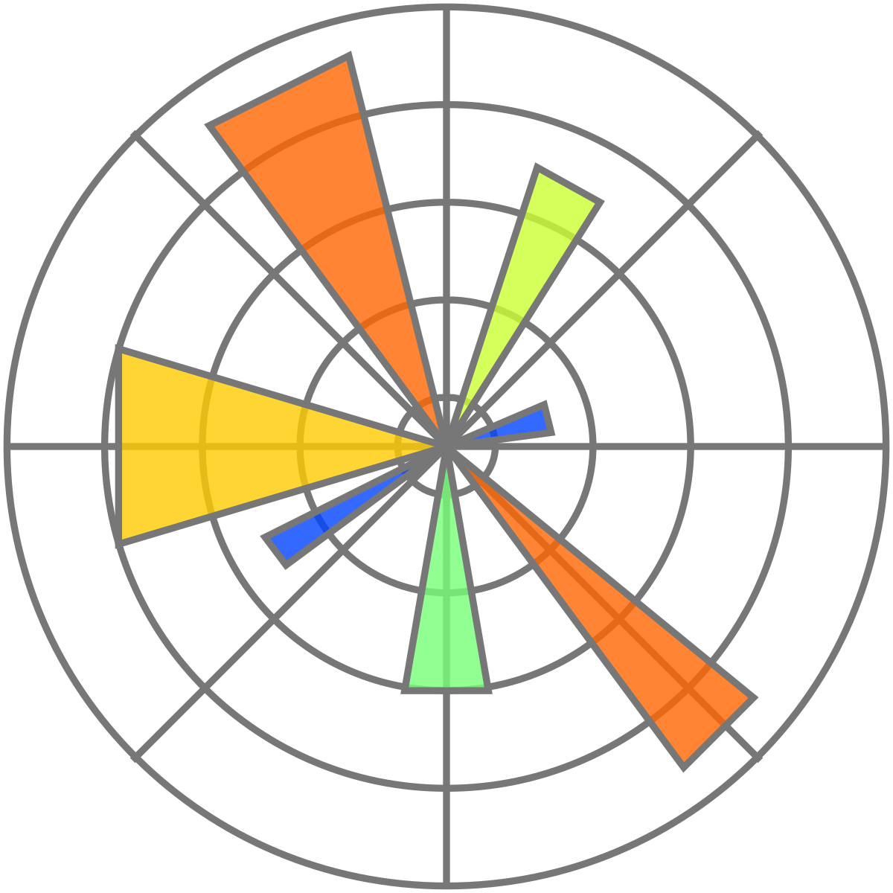

## Hi!👋 Welcome to my page! :)

```python
class MachineLearningEngineer:
    def __init__(self):
        self.experience_years = 2
        self.skills = [
            "deploying machine learning, computer vision, and NLP models",
            "data engineering of large data",
            "development and implementation of state-of-the-art models",
            "training in the cloud or dedicated servers",
            "model serving and monitoring"
        ]
        self.knowledge = [
            "academia-level and industry-level machine learning",
            "experimentations",
            "meeting business performance metrics"
        ]
        self.projects = [
            "cybersecurity",
            "healthcare",
            "meteorology"
        ]
        self.hobbies = [
            "playing Dota",
            "tending to my cats"
        ]

    def __str__(self):
        intro = "Hi, I am a machine learning research engineer with over {} years of end-to-end experience in {}.".format(
            self.experience_years, ", ".join(self.skills)
        )
        knowledge = "I have in-depth knowledge of {} where I am proficient in {}.".format(
            " and ".join(self.knowledge[:2]), ", ".join(self.knowledge)
        )
        projects = "I constantly immerse myself in different AI domains and have worked in {} projects.".format(
            ", ".join(self.projects)
        )
        hobbies = "Outside of my regular programming, I mostly {}.".format(" and ".join(self.hobbies))
        return "{}\n{}\n{}\n{}".format(intro, knowledge, projects, hobbies)

if __name__ == "__main__":
    profile = MachineLearningEngineer()
    print(profile)

```

## Skills

### AI Frameworks
<table>
    <tr>
        <td align="center" width="96">
          
          <br>PyTorch
        </td>
        <td align="center" width="96">
          
          <br>TensorFlow
      </td>
    </tr>
</table>

### Engineering:
<table>
  <tr>
    <td align="center" width="96">
      
      <br>Python3
    </td>
    <td align="center" width="96">
      
      <br>C#
    </td>
    <td align="center" width="96">
      
      <br>PowerShell
    </td>
    <td align="center" width="96">
      
      <br>Azure
    </td>
    <td align="center" width="96">
      
      <br>AWS
    </td>
    <td align="center" width="96">
      
      <br>ONNX
    </td> 
  </tr>
</table>

### Data Manipulation & Visualization
<table>
  <tr>
    <td align="center" width="96">
      
      <br>Polars
    </td>
    <td align="center" width="96">
      
      <br>Vaex
    </td>
    <td align="center" width="96">
      
      <br>Numpy
    </td>
    <td align="center" width="96">
      
      <br>Pandas
    </td>
    <td align="center" width="96">
      
      <br>Jupyterlab
    </td>
    <td align="center" width="96">
      
      <br>MySQL
    </td>
    <td align="center" width="96">
      
      <br>Seaborn
    </td>
    <td align="center" width="96">
      
      <br>Matplotlib
    </td>
  </tr>
</table>
